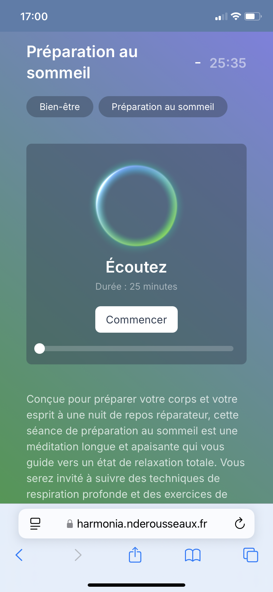

<p align="center">
	
</p>

<p align="center">
	
</p>

# <div align="center">Harmonia</div>
<div align="center">
	<samp>A web app to help you relax.</samp>
</div>

<hr>


## ℹ️ About
Harmonia is a web app that helps you relax with sophrology exercises. It permit you to listen to audio exercises and follow the instructions to relax. It is built with Next.js, Tailwind CSS and Vercel. 
It use a PostgreSQL database, and a blob storage to store the audio files.

Some GSAP and Framer Motion animations are used to make the app more dynamic.

<!-- <p align="center">
	
</p> -->


## ✨ Features
- Display a list of lessons
- Display information about a lesson
- Play the audio of a lesson
- Navigate between the audio of a lesson
- Mark the lesson as done


## 🚀 Tech Stack & Practices
This project implement the best practices of web app development : 
- Nested routing
- Server-side rendering (SSR)
- Dynamic rendering
- Responsive design
- Loading skeleton
- Images and fonts optimization
- Handling errors (404, 500)
- Mutating data, with refreshing the cache
- Accessibility
- SEO optimization
- Prepare to social sharing


## 🛠️ Getting started

### Installation

```bash
$ pnpm install
$ cp .env.example .env
```

Fill the `.env` file with your own values. Then, init the database with the struct.sql file :

```bash
$ plsql -U <user> -d <database> -f data/struct.sql
````


### Development
```bash
$ pnpm run dev 
#or, with vercel
$ vercel dev
```

### Deployment
```bash
$ vercel --prod
```

Or simply push to the main branch, if you have the vercel integration enabled.

> **Note:** Don't forget to set the environment variables in the vercel dashboard.


## 📝 Future improvements
- Create a home page
- Add an authentication system
- Adding a comment section (with a rating system)
- Adding a search bar
- Sort lessons by category


## 🌅 Some screenshots
<!-- <div>
	
	
	
	
	
	
	
	
</p> -->